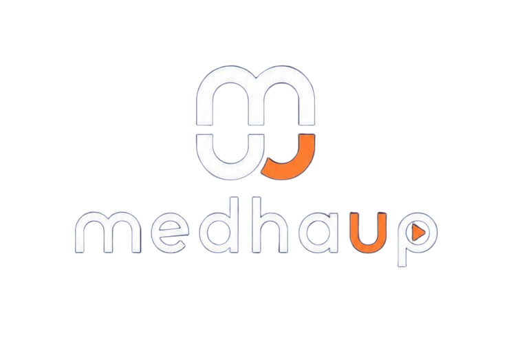

<p align="center">
  
</p>

# medhaup Web Platform

The official web platform for **medhaup**, an education company focused on
nursing exam preparation in West Bengal: the WBJEEB ANM(R) and GNM entrance
course, plus NORCET, RRB Nursing, JENPAS(UG), JEPBN, JEMScN and year-wise ANM, GNM and D.Pharmacy courses. The platform brings together course discovery, admissions, bilingual
learning resources, content publishing, student-success stories, and marketing
measurement in one responsive application.

**Production:** [medhaup.com](https://medhaup.com)

This is a private company repository. It is maintained for medhaup's product,
content, marketing, and operational workflows and is not a personal starter
project.

## Platform capabilities

| Area                  | Capabilities                                                                                                                                           |
| --------------------- | ------------------------------------------------------------------------------------------------------------------------------------------------------ |
| Course and admissions | Course information, current-batch availability, app-download links, callback requests, and WhatsApp-assisted admissions                                |
| Learning resources    | Subject syllabi, full syllabus downloads, previous-year papers, current affairs, free resources, educational articles, and page-aware AI doubt support |
| Student trust         | Gallery content and a dedicated wall of student-success photos                                                                                         |
| Store                 | Supabase-managed products with WhatsApp checkout hand-off                                                                                              |
| Content operations    | Authenticated admin CMS with draft/publish controls, file uploads, site settings, and collection management                                            |
| Marketing             | GA4 funnel events, 90-day last-non-direct UTM attribution, lead-source capture, and an internal campaign-link builder                                  |
| Search visibility     | Route metadata, canonical URLs, Open Graph images, structured data, dynamic sitemap generation, robots rules, and a web app manifest                   |

## System overview

| Layer            | Technology                                  | Responsibility                                                                  |
| ---------------- | ------------------------------------------- | ------------------------------------------------------------------------------- |
| Web application  | Next.js 16 App Router, React 19, TypeScript | Server-rendered pages, client interactions, routing, metadata, and revalidation |
| Design system    | Tailwind CSS 4, Framer Motion, Lucide React | Responsive presentation, motion, and interface icons                            |
| Application data | Supabase Postgres                           | Published content, batches, products, site settings, and admin membership       |
| Authentication   | Supabase Auth                               | Email/password sessions for the admin interface                                 |
| File storage     | Supabase Storage                            | Public images and downloadable PDF resources                                    |
| Lead delivery    | Web3Forms                                   | Contact and admission form delivery                                             |
| Measurement      | Google Analytics 4                          | Funnel events and campaign attribution                                          |

Public content is loaded from Supabase on the server. Most content routes use a
60-second revalidation window, while the success wall requests current data on
every render. If a content query fails, the data layer logs the failure and
returns an empty result; content-driven pages then show their configured
"Coming Soon" state. Site contact settings fall back to safe defaults.

## Application routes

### Public website

| Route                        | Purpose                                                                             |
| ---------------------------- | ----------------------------------------------------------------------------------- |
| `/`                          | Company homepage, course highlights, batches, and calls to action                   |
| `/course`                    | Detailed ANM/GNM course information                                                 |
| `/norcet`                    | NORCET exam pattern, subjects, syllabus, eligibility, free resources and enrolment enquiries   |
| `/admission`                 | App-based admission and callback request flow                                       |
| `/syllabus`                  | Subject breakdown and syllabus downloads                                            |
| `/pyq`                       | Previous-year question papers and answer keys                                       |
| `/resources`                 | Free study resources and downloadable material                                      |
| `/current-affairs`           | Daily updates and monthly current-affairs PDFs                                      |
| `/blogs` and `/blogs/[slug]` | Educational article index and article pages                                         |
| `/store`                     | Books, notes, test series, and WhatsApp checkout                                    |
| `/gallery`                   | Classes, toppers, and event photography                                             |
| `/wall-of-success`           | Published student-success photos                                                    |
| `/about`                     | Company and educator information                                                    |
| `/contact`                   | Contact channels, enquiry form, and common questions                                |

### Internal administration

| Route                    | Purpose                                                                 |
| ------------------------ | ----------------------------------------------------------------------- |
| `/admin/login`           | Supabase email/password authentication                                  |
| `/admin`                 | Publishing dashboard and collection status                              |
| `/admin/[collection]`    | Create, edit, publish, unpublish, upload, and delete collection records |
| `/admin/settings`        | Company contact details and social-channel settings                     |
| `/admin/marketing-links` | Standardized campaign URL generation                                    |

Admin and API paths are excluded from indexing through both robots rules and
response headers.

## Repository structure

```text
app/                    Next.js routes, layouts, metadata, sitemap, and manifest
components/
  layout/               Navigation, footer, and shared site chrome
  provider/             Site settings, attribution, and analytics providers
  sections/             Page-level product and content sections
  seo/                  Structured-data rendering
  ui/                   Shared interface components
docs/                   Operational documentation
lib/
  admin/                CMS collection definitions and management interfaces
  supabase/             Browser and server Supabase clients
  analytics.ts          GA4 event helpers
  attribution.ts        UTM capture, persistence, and form enrichment
  data.ts               Published-content queries and data mapping
  seo.ts                Canonical metadata and schema helpers
  settings.ts           Site settings, defaults, and derived contact links
public/                 Brand assets and bundled downloadable resources
supabase/               Supabase CLI configuration and checked-in migrations
```

## Local development

### Prerequisites

- Node.js 20.9 or newer
- npm
- Access to an approved medhaup Supabase project
- Appropriate Web3Forms and GA4 access when working on those integrations

### Installation

From the repository root:

```bash
npm ci
```

Create `.env.local` and add the required public configuration:

```dotenv
NEXT_PUBLIC_SUPABASE_URL=https://your-project.supabase.co
NEXT_PUBLIC_SUPABASE_ANON_KEY=your-anon-key

# Optional integrations
NEXT_PUBLIC_GA_ID=G-XXXXXXXXXX
NEXT_PUBLIC_APP_STORE_URL=https://apps.apple.com/app/your-app

# Server-only medhaup AI configuration
AI_FEATURE_ENABLED=false
GEMINI_API_KEY=your-private-google-ai-studio-key
GEMINI_MODEL=gemini-3.5-flash-lite
```

Start the development server:

```bash
npm run dev
```

Open [http://localhost:3000](http://localhost:3000).

### Environment variables

| Variable                        | Required | Purpose                                                                                     |
| ------------------------------- | -------- | ------------------------------------------------------------------------------------------- |
| `NEXT_PUBLIC_SUPABASE_URL`      | Yes      | Supabase project URL used by public pages and the admin CMS                                 |
| `NEXT_PUBLIC_SUPABASE_ANON_KEY` | Yes      | Browser-safe Supabase anonymous key; access must be constrained by RLS                      |
| `NEXT_PUBLIC_GA_ID`             | No       | Enables Google Analytics and the custom funnel-event layer                                  |
| `NEXT_PUBLIC_APP_STORE_URL`     | No       | Enables the Apple App Store action on the admission page                                    |
| `AI_FEATURE_ENABLED`            | No       | Enables the page-aware AI UI when the provider key is configured; disabled by default       |
| `GEMINI_API_KEY`                | For AI   | Private Google AI Studio API key, used only on the server; never prefix with `NEXT_PUBLIC_` |
| `GEMINI_MODEL`                  | No       | Gemini model ID; defaults to `gemini-3.5-flash-lite`                                         |
| `TAVILY_API_KEY`                | For search | Private Tavily API key; ordinary chat works without it; never prefix with `NEXT_PUBLIC_` |
| `AI_MAX_OUTPUT_TOKENS`          | No       | Maximum generated tokens per answer; defaults to `1536`, bounded to `128`–`4096`            |
| `AI_REQUEST_TIMEOUT_MS`         | No       | Combined search and answer timeout in milliseconds; defaults to `30000`                    |
| `AI_MAX_MESSAGE_CHARS`          | No       | Maximum student-question length; defaults to `1200`                                         |
| `AI_MAX_CONTEXT_CHARS`          | No       | Maximum trusted page-context length; defaults to `6500`                                     |
| `AI_RATE_LIMIT_REQUESTS`        | No       | Requests allowed per client IP, server instance, and window; defaults to `8`                |
| `AI_RATE_LIMIT_WINDOW_MS`       | No       | Rate-limit window in milliseconds; defaults to 24 hours                                     |

All `NEXT_PUBLIC_*` values are visible to browsers and are embedded at build
time. Never place service-role keys, database passwords, or other private
credentials in these variables. Environment files are ignored by Git and must
not be committed.

The Gemini adapter calls Google's `generateContent` REST endpoint with a
server-only `x-goog-api-key` header, separate system instructions, and bounded
conversation history. English, Bengali, and common mixed-language indicators of
current information trigger one Tavily Search REST request, including short
follow-ups. Gemini's built-in Google Search tool is never enabled.

Tavily uses `search_depth: "basic"` and `auto_parameters: false` for a predictable
one-credit search, with at most five results. Queries stay under 400 characters;
short follow-ups include the previous question, not the entire conversation or
trusted site context. Result snippets are bounded to 1,200 characters each and
passed to Gemini as untrusted reference data. The UI displays validated HTTPS
source links returned by Tavily, not links invented by the model.
Queries explicitly naming WBJEE/WBJEEB are restricted to `wbjeeb.nic.in` and
`admissions.nic.in`, and queries naming NORCET to `aiimsexams.ac.in` and
`aiims.edu`, to prioritize the responsible exam authority.

The assistant's trusted context tells it on every page that the NORCET course
has course fees and batch details available from the team, and the `/norcet` page
context adds the exam pattern, syllabus, eligibility and any live NORCET
resources so it can answer NORCET questions without inventing details.

Ordinary study questions skip Tavily. Search authentication, quota and network
failures are surfaced without calling Gemini for an unverified current answer.
Empty results explicitly instruct Gemini to say that no usable results were found.
Search and answer generation share one timeout. There are no automatic retries,
extra research/extraction calls, or fallback to Google's paid Search tool.
medhaup-specific claims remain grounded in trusted server context.

Create the key in [Google AI Studio](https://aistudio.google.com/apikey) and set
`AI_FEATURE_ENABLED=true` to enable the assistant. API-key names and project
names/numbers are metadata, not model IDs or credentials. Production also needs
the server-only key in its deployment environment. Create a separate search key
in [Tavily](https://app.tavily.com/) and set `TAVILY_API_KEY` locally and in the
deployment environment (the spelling is `TAVILY`, not `TAVIFY`). Installing a
Tavily editor skill or CLI alone does not configure the website's runtime.
Restart the local server
after updating environment files.

The default is `gemini-3.5-flash-lite`; Google no longer makes 2.5 Flash-Lite
available to new accounts. Gemini text and Tavily Search have independent quotas.
Actual quotas depend on the Google project; check
[AI Studio limits](https://ai.google.dev/gemini-api/docs/rate-limits) and
[Gemini pricing](https://ai.google.dev/gemini-api/docs/pricing) before switching
models or billing tiers. Tavily currently includes 1,000 free credits per month
with no card required; basic searches cost one credit. This is a shared allowance
for the website, not a per-student allowance. See
[Tavily credits and pricing](https://docs.tavily.com/documentation/api-credits).
Requests are not automatically retried or routed to paid models when a quota is
exhausted. Provider retry delays are returned to the client, and provider error
payloads and credentials are never logged.

In production the AI trigger is hidden unless both the feature flag and Gemini
configuration are present. The in-memory client-IP limiter remains separate
from both providers' quotas and resets when its server instance restarts.

The Google Play listing is configured in the admission experience. Web3Forms
submission configuration is maintained separately in the admission and contact
form components. Update third-party configuration only through company-owned
accounts and verify both forms after any change.

## Supabase provisioning

The application expects the following tables:

- `admins`
- `products`
- `blog_posts`
- `pyqs`
- `gallery_items`
- `success_photos`
- `current_affairs_monthly`
- `current_affairs_daily`
- `resources`
- `syllabus_subjects`
- `syllabus_downloads`
- `batches`
- `norcet_resources`
- `site_settings`

It also expects public `images` and `files` storage buckets. Their policies must
allow published assets to be read publicly and restrict create, update, and
delete operations to authorized administrators.

The checked-in migrations currently provision the `admins`, `success_photos`
and `norcet_resources` tables and their row-level security policies. They do
**not** contain the complete production schema or seed data. A fresh local Supabase
instance therefore cannot reproduce the entire application from migrations
alone; use an approved provisioned project until full schema migrations are
available.

To authorize an admin:

1. Create the employee's email/password user in Supabase Auth.
2. Add that user's UUID to `public.admins` through an approved administrative
   workflow.
3. Confirm that row-level security policies grant that member only the required
   CMS and storage operations.

The route guard in the browser improves the admin experience, but it is not the
security boundary. Supabase row-level security and storage policies must protect
all company data independently of the interface.

## Content operations

The CMS is defined in `lib/admin/collections.ts`. It manages store products,
blogs, PYQs, galleries, success photos, current affairs, resources, syllabus
content, and batches.

A standard publishing workflow is:

1. Sign in at `/admin/login` with an authorized company account.
2. Create or edit the relevant record and upload approved assets.
3. Review titles, dates, URLs, downloadable files, and accessible image alt
   text.
4. Use the publish control only when the content is ready for customers.
5. Verify the public route. Allow up to 60 seconds for revalidated pages to
   refresh.

For homepage question-paper downloads, open **Previous Year Papers** at
`/admin/pyq`, choose **Add Paper**, enter the title, year, and language, and
upload the **Question Paper PDF**. An **Answer Key PDF** is optional. Use
**View uploaded PDF** to review each file, save the record, then switch its
**DRAFT** badge to **LIVE**. The same published records appear below the hero
on `/` and in the `/pyq` library. Unpublishing removes a paper from both views
after revalidation. With no published records, the homepage shows an empty
state rather than sample downloads. Uploads use the existing `files` bucket
under `pyq/`; no new database table or bucket is required.

NORCET study material is managed at `/admin/norcet-resources` (**NORCET —
Resources**). Choose a category (Syllabus, Previous Year Papers, Notes, Mock
Tests, Guides), the exam stage, an optional subject, and upload the PDF; the
file size is filled in automatically. Switch the record from **DRAFT** to
**LIVE** to show it in the resources grid on `/norcet`. A live **Syllabus**
item also powers the syllabus download button on that page. With no live
records the page shows a resource enquiry block with an enrolment link; the rest of the NORCET page (exam pattern, subjects, syllabus,
eligibility, FAQs) is code-managed in `lib/norcet.ts`, as is the course availability
state (`NORCET_COURSE.status`). Uploads use the existing `files` bucket under
`norcet-resources/`. Run the checked-in migration
`supabase/migrations/202609100001_create_norcet_resources.sql` on the project
before using the collection.

The NORCET enrolment enquiry form on `/norcet` submits to Web3Forms with
`form_type=norcet_enrolment` and emits a `generate_lead` event with
`lead_type=norcet_enrolment`; no database table is involved.

Global phone, email, address, WhatsApp, and social-channel values are managed at
`/admin/settings`. Code defaults are defined in `lib/settings.ts` and are used
if the settings record cannot be loaded.

## Analytics and attribution

GA4 is loaded only when `NEXT_PUBLIC_GA_ID` is configured. The application
tracks important funnel actions such as lead generation, WhatsApp and phone
clicks, admission intent, app downloads, file downloads, checkout starts, and
verified purchases.

Inbound campaign attribution requires the complete core UTM set:

```text
utm_source + utm_medium + utm_campaign
```

`utm_content` and `utm_term` are optional. Valid attribution is retained in the
browser for 90 days using last-non-direct behavior and is attached to GA events
and Web3Forms submissions. Generate company campaign links through
`/admin/marketing-links`; do not add UTMs to internal navigation.

See [docs/analytics.md](docs/analytics.md) for event registration, GA4 custom
dimensions, campaign conventions, and deployment verification.

## SEO and discoverability

The application provides:

- Shared and page-specific metadata with canonical URLs
- Open Graph and social-card images
- Organization, website, breadcrumb, course, article, and resource schema
- A sitemap containing static routes, published articles, and content images
- Robots rules and `X-Robots-Tag` protection for internal routes
- A standalone web app manifest and branded icons

The production origin is centralized in `lib/seo.ts` and is also referenced by
the sitemap and robots implementations. Coordinate domain changes across all
three locations and validate generated metadata before release.

## Quality checks

Run the complete local quality gate before opening or merging a change:

```bash
npm run lint
npx tsc --noEmit
npm run build
```

| Command            | Purpose                                      |
| ------------------ | -------------------------------------------- |
| `npm run dev`      | Start the local Turbopack development server |
| `npm run lint`     | Run the repository ESLint rules              |
| `npx tsc --noEmit` | Perform strict TypeScript validation         |
| `npm run build`    | Create the optimized production build        |
| `npm run start`    | Serve a completed production build           |

Run `node --test scripts/ai-gemini.test.mjs` for the Gemini adapter and route
regression checks, and `node --test scripts/norcet.test.mjs` for the NORCET
data, AI context, admin collection and section rendering checks; they mock
Gemini, Tavily and Supabase and do not consume API quota. Lint,
type-check, build, and focused browser verification remain the release baseline.

## Deployment

Deploy to a platform that supports the full Next.js server runtime and
revalidation behavior. A plain static export is not the expected deployment
model because the application loads changing Supabase content on the server.

Before a production release:

1. Configure all required environment variables in the build environment.
2. Run lint, type-check, and the production build.
3. Confirm Supabase RLS, storage policies, and admin membership.
4. Smoke-test public content, authentication, uploads, both lead forms, and
   WhatsApp/app links.
5. Verify canonical metadata, `robots.txt`, `sitemap.xml`, and social previews.
6. Validate GA4 events in Realtime or DebugView and confirm UTM values on a test
   lead.
7. Check the primary mobile layouts before promoting the release.

## Engineering and data-handling standards

- Keep customer and student information out of source control, screenshots,
  fixtures, and logs.
- Preserve strict TypeScript and the existing server/client component
  boundaries.
- Treat Supabase RLS as mandatory for every exposed table and storage bucket.
- Do not expose private keys through `NEXT_PUBLIC_*` variables or client code.
- Preserve draft/publish behavior when adding content collections.
- Update operational documentation whenever analytics events, environment
  variables, routes, or external integrations change.
- Use company-owned accounts for Supabase, analytics, forms, domains, and app
  store integrations.

## Ownership

This repository contains company-owned medhaup software and brand assets. No
open-source license is granted. Copying, redistribution, publication, or reuse
outside authorized medhaup work requires written approval.

For product or operational enquiries, contact
[contact@medhaup.com](mailto:contact@medhaup.com).
